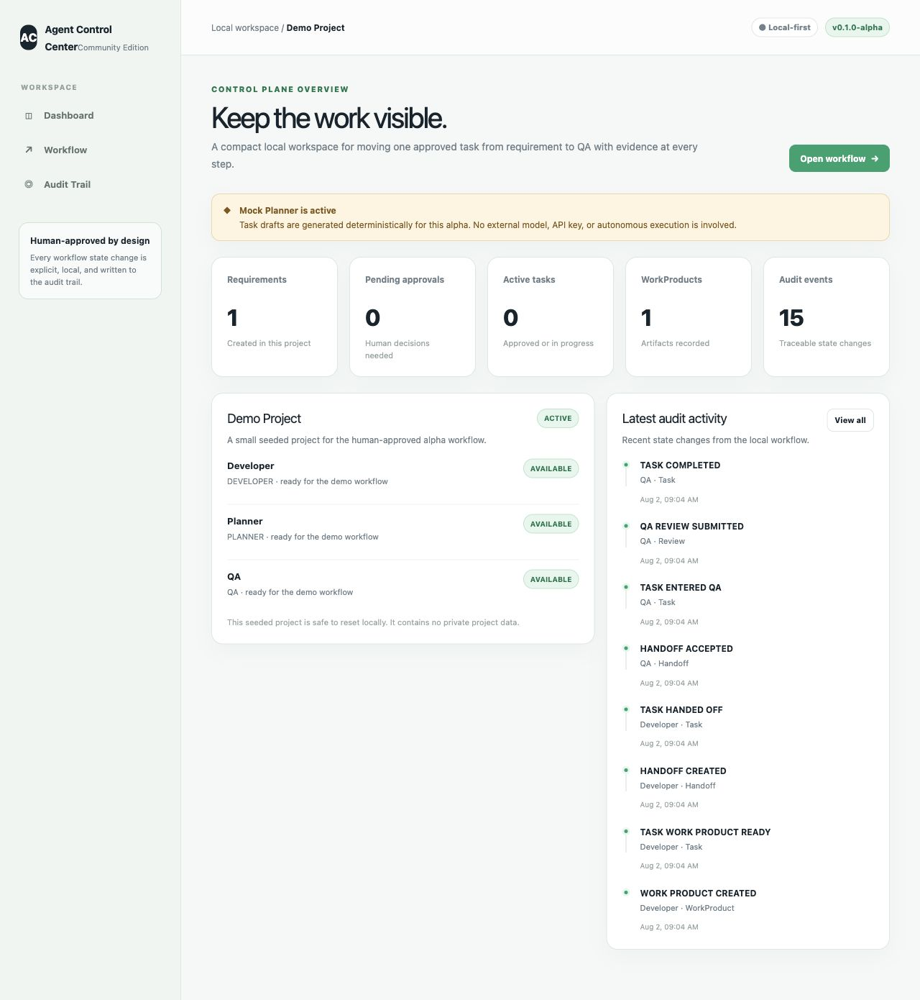

# AI Agent Control Center 社区版

> 一个本地优先、带人工审批、工作产物交接和完整审计链路的 AI Agent 协作控制台。

当前版本：`v0.1.0-alpha`。这是一个可以在本机独立运行的 Alpha 社区版，用于演示一条带治理边界的 Agent 协作工作流。它明确是 **Alpha**、**Local-first**、**Human-approved**，并且 **Not production ready**。

它不是 Fully Autonomous、Automatic Software Company 或 Zero Human Intervention 系统。默认 Planner 是确定性的 Mock Planner，页面会明确展示这一点。



## 已完成能力

- Seed 创建 Demo Project，以及 Planner、Developer、QA 三个 Agent。
- 在 Workflow 页面创建 Requirement。
- 确定性 Mock Planner 生成 Task Draft 和 Approval Request。
- 人工批准后 Developer 才能接收 Task。
- Developer 接收 Task 并记录本地 WorkProduct。
- Developer 发起 Handoff，QA 显式接收。
- QA 提交 Review 并完成 Task。
- Audit Trail 展示操作者、对象、状态变化、Evidence 和时间。
- Prisma + SQLite 本地数据存储，不需要外部 API Key。

## 尚未完成能力

- 真实模型调用或生产级 Planner Agent。
- 自动编排、自动拆解任务或后台 Worker。
- 自动修改代码、Terminal 执行、部署、Merge 或 Push。
- 登录、多用户权限、多租户或云端托管。
- 生产可观测性、合规治理或企业级审计控制。

## 架构

```text
React UI
  -> Next.js Route Handlers
    -> Workflow Service（校验与状态机）
      -> Repository 层
        -> Prisma Client -> SQLite
```

每个状态变化动作都会在同一个事务中写入 `AuditEvent`。完整说明见 [`docs/architecture.md`](docs/architecture.md)。

## 本地安装

要求：Node.js 20.9+、pnpm 10+（支持 pnpm 11）和 Git。

```bash
git clone <repository-url>
cd ai-agent-control-center
pnpm install
cp .env.example .env
pnpm db:setup
pnpm dev
```

打开 [http://localhost:3000](http://localhost:3000)。Seed 会创建独立的 Demo Project，默认数据库为 `file:./dev.db`。

如果本机 Prisma migration engine 不可用，`pnpm db:setup` 会报告回退并执行同一份仓库内 SQLite migration SQL，不会连接远程数据库。

一键初始化并启动：

```bash
pnpm demo
```

## Demo 操作流程

1. 打开 **Workflow**，创建 Requirement。
2. 选择 Requirement，点击 **Generate task draft**。
3. 检查 Draft，点击 **Approve task**。
4. 让 Developer 接收已批准 Task。
5. 创建 WorkProduct 并记录 Evidence。
6. 创建 Handoff，随后让 QA 接收。
7. 提交批准的 QA Review。
8. 打开 **Audit Trail**，检查全部状态变化。

完整步骤见 [`docs/demo-workflow.md`](docs/demo-workflow.md)。

## Mock Planner 说明

Mock Planner 根据 Requirement 标题和描述使用确定性模板生成本地 Draft，并记录 `plannerMode = MOCK_DETERMINISTIC`。它不调用模型、不访问网络、不读取仓库、不使用 API Key，也不执行代码。

## 常用命令

```bash
pnpm dev              # 启动开发服务
pnpm demo             # 初始化数据库、Seed Demo Project 并启动
pnpm db:setup         # 生成 Prisma Client、执行 migration、Seed
pnpm lint             # ESLint
pnpm typecheck        # TypeScript
pnpm test             # 隔离的流程与状态机测试
pnpm security:scan    # 基础密钥/路径扫描
pnpm build            # 生产构建
```

## Roadmap

下一步保持小范围、人工确认和可回退：

1. 丰富本地 WorkProduct Evidence 和 Review 历史。
2. 增加可插拔 Planner 接口，同时保留 Mock Planner 安全默认值。
3. 增加可选的本地身份认证和项目隔离。
4. 在单独批准后接入只读外部模型适配器。

详见 [`docs/roadmap.md`](docs/roadmap.md)。

## Contributing

请先阅读 [`CONTRIBUTING.md`](CONTRIBUTING.md)。保持修改小而清晰，为新增状态变化补充测试，并保留人工审批边界。

## Security

禁止提交 `.env`、数据库文件、Token、Cookie、凭证或私人数据。详见 [`SECURITY.md`](SECURITY.md)。

## License

本项目采用 [MIT License](LICENSE)。
